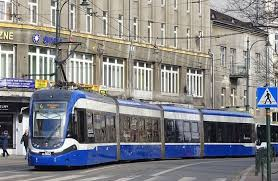

# test-2-proba
## TEAM
1.Wiktoria Świątkowska- WiktoriaSwiatkowska- 1, 6
2. Wiktoria Żełubowska- WiktoriaZelubowska- 2, 3
3. xyz- xyz- 4, 5
## INTRODUCTION
Public transport in Krakow is one of the most developed urban transit systems in Poland. The city has an extensive network of trams and buses that cover both the city center and the surrounding districts. The main operator, MPK Kraków, ensures regular service, modern vehicles, and eco-friendly solutions such as electric and hybrid buses, making public transport efficient and sustainable.

Trams are the backbone of Krakow’s transport system. There are dozens of lines connecting key parts of the city, from Nowa Huta to Bronowice. In recent years, low-floor trams and smart passenger information systems have been introduced, helping commuters plan their routes more easily and reducing waiting times at stops.

Buses complement the tram network by serving areas without tram tracks. With numerous day and night lines, residents can travel around the city at any time of day. The integration of the urban network with the suburban rail system, the Krakow Agglomeration Railway (SKA), also allows for quick connections with nearby towns. Altogether, Krakow’s public transport offers a convenient and eco-friendly alternative to traveling by car.
The table below shows examples of trams and buses in Krakow and their travel times.
## DATA
Each line connects different parts of the city and has different lenghts and durations.
| Line | Start | End | Time |
|------|-------|-----|------|
| 105  | Nowa Huta | Centrum | 25 |
| 3    | Nowa Huta | Bronowice | 40 |
| 9    | Mistrzejowice | Borek Fałęcki | 45 |

## IMAGES
Below are images showing public transport in Krakow.  
Two come from the Internet, and one is saved locally in the project folder.

